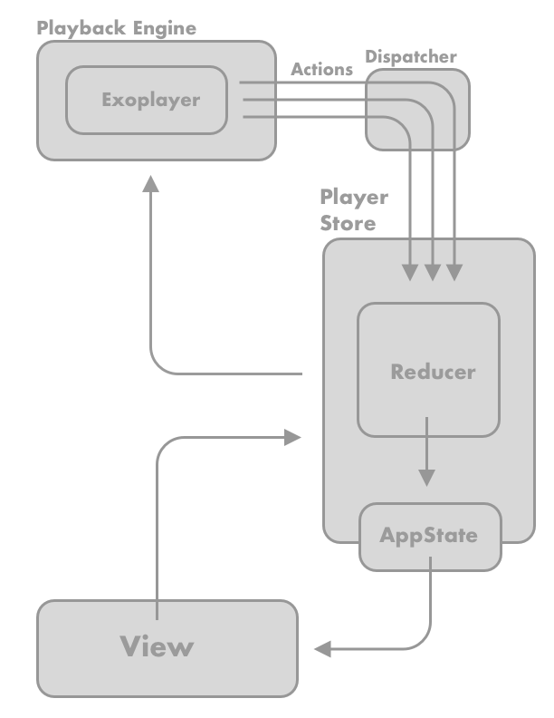

Welcome to Project Armadillo, a delightful audio player for Android.

## Features

- [x] Playback and downloading
- [x] HLS or MP4 audio
- [x] Encryption
- [x] Analytics support
- [x] Error Propagation
- [x] Playback while the app is backgrounded
- [x] Immediate solution for playing track based / chapterized audio content
- [x] Configurable foreground notifications for playback and downloading. Conforms to Oreo+ notification requirements.
- [x] State object with regular updates for keeping the UI in sync
- [x] Support for [Android Auto](https://developer.android.com/training/cars)
- [x] Implements [MediaBrowserService](https://developer.android.com/guide/topics/media-apps/audio-app/building-a-mediabrowserservice) and [MediaSession](https://developer.android.com/guide/topics/media-apps/working-with-a-media-session#init-session) apis
- [x] Test app to see it in action

## What is Armadillo?

Armadillo is a fully featured audio player. Armadillo leverages [Google's Exoplayer](https://github.com/google/ExoPlayer/) library for 
its audio engine. Exoplayer wraps a variety of low level audio and video apis but has few opinions of its own for actually using 
internet based audio in an Android app. The leap required from Exoplayer to audio player is enormous both in terms of the amount of code 
needed as well as the amount of domain knowledge required about complex audio related subjects. Armadillo provides a turn key solution for powering an audio player and providing the information to update a UI.

- **Easy-to-use** because it outputs state updates with everything needed for a UI or analytics. Works in the background state.
- **Effective** because it uses [Google's Exoplayer](https://github.com/google/ExoPlayer/) as the playback engine.
- **Ready-to-go** out of the box usage for a developer looking to use an audio player.
- **Robust** because it contains numerous configuration options for supporting most any requirement and includes a number of other android apis required for a high quality audio player.

## What Armadillo does not provide

- No UI or controls
- The state of a download will need to be tracked in the app ex. (downloaded, not downloaded)
- The player will need to be managed as a singleton, this is best done with a DI framework such as [Dagger](https://dagger.dev/)
- The app or server must configure the manifests and provide formatted audio content


## Basic Usage

The library is hosted with Github packages so you will need to add the Github registry with authentication to your build.gradle file. See
 the official docs on authenticating 
 [here](https://docs.github.com/en/packages/working-with-a-github-packages-registry/working-with-the-gradle-registry#authenticating-to-github-packages). But you will need to:

1. Generate a personal access token from your Github account.
2. Add the Github package registry with authentication to your `build.gradle` file.
3. For Armadillo version 1.4.1: Add a gradle dependency for com.google.android.exoplayer:exoplayer-core:2.19.1. If you wish to use 
   downloading in Android 14 you will need to use a forked version of this dependency since Exoplayer does not support Android 14.

```kotlin
maven {
   name = "GitHubPackages"
   url = uri("https://maven.pkg.github.com/scribd/armadillo-and")
   credentials {
       username = "github_username"
       password = "github_access_token"
   }
}
```

It's easy to get started. Head over to the TestApp for more details.

```kotlin
// construct your media
val media = AudioPlayable(
    id = 0,
    title = "Google Hosted Mp3",
    request = AudioPlayable.MediaRequest.createHttpUri("https://storage.googleapis.com/exoplayer-test-media-0/play.mp3"),
    chapters = emptyList()
)

// initialize the player
val armadilloPlayer = ArmadilloPlayerFactory.init()

// begin playback
armadilloPlayer.beginPlayback(media)
        
// listen for state updates
armadilloPlayer.armadilloStateObservable.subscribe {
    
    // update your UI here

}
```

## Other Features
- Armadillo supports adding custom headers to HLS media requests. In order to use this feature, audio URLs must have a unique numerical ID
that is in the  master playlist URL.

### Armadillo Library
You can build the library with the command `./gradlew :Armadillo:assembleRelease`.

### Contributing
See the guide [here](https://github.com/scribd/armadillo/blob/main/CONTRIBUTING.md)

## Architecture Explained


